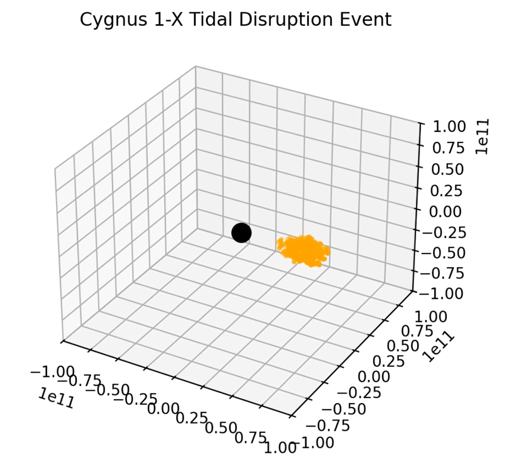
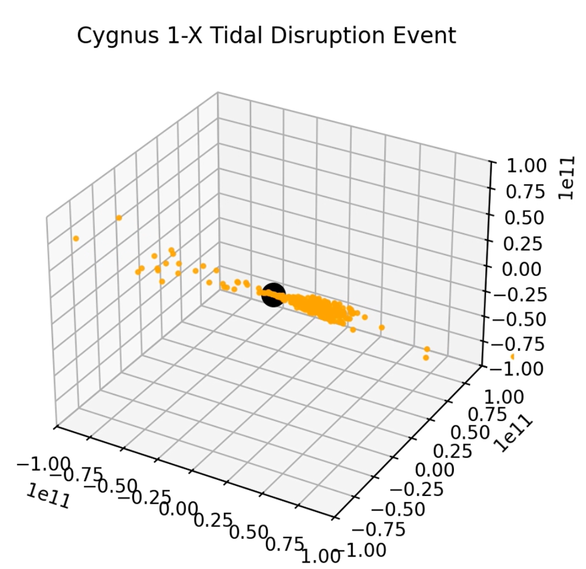

# TDE-simulation
Simulation of tidal disruption event losely modeled of the Cygnus 1-X system. Star is represented by a cloud of particles with masses that add up to the star mass.

Key screenshots of the animation are in **Sim_Images** folder. Entire animation is **Cygnus 1-X Simulation.mp4**

This was produced as a final project for Astron 9 (intro to python for astrophysics research) 

**I personaly created:**  star as a cloud of particles, the class object which gives data (mass, position, velocity) to our cloud of particles and simualtes timesteps (defined by dt), 3d plots, and the actual animation.

TDE simulation – stretching begins

TDE simulation – Star is Ripped Apart

Libraries utilized include Numpy, Matplotlib, and FFMpegWriter.

Runtime: 2 minutes.

Limitations: This project lacks the star orbiting our black hole, so we cannot see the formation of an accretion disc. Our black hole also lacks relativity principals which would cause objects to get 'stuck' within the event horizon due to extreme spacetime curvature. 
