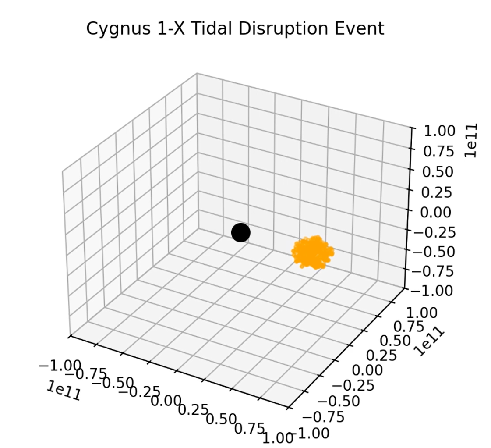

# TDE-simulation
This project simulates a **Tidal Disruption Event** loosely modeled off the **Cygnus 1-X System**. The star is represented as a cloud of particles whose combined mass equals the mass of the star. The black hole is modeled as a singularity point mass.

Key screenshots from the simulation:

**TDE simulation – Initial State**

**TDE simulation – Stretching Begins**

**TDE simulation – Star is Disrupted**

**TDE simulation – Star is Further Disrupted**

A full animation is available: **[Cygnus 1-X Simulation.mp4](Cygnus 1-X Simulation.mp4)**

This was produced as a final project for Astron 9 (intro to python for astrophysics research) 

**I personaly created:**  star as a cloud of particles, the class object which gives data (mass, position, velocity) to our cloud of particles and simualtes timesteps (defined by dt), 3d plots, and the actual animation.

the animation are in **Sim_Images** folder. Entire animation is **Cygnus 1-X Simulation.mp4**
**Libraries utilized:** Numpy, Matplotlib, and FFMpegWriter.

**Runtime:** 2 minutes.

**Limitations:** This project lacks the star orbiting our black hole, so we cannot see the formation of an accretion disc. Our black hole also lacks relativity principals which would cause objects to get 'stuck' within the event horizon due to extreme spacetime curvature. 
